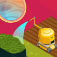
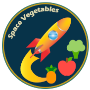
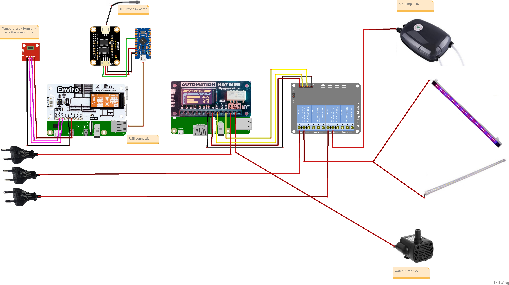

# Space Vegetables

Space Vegetables is a Raspberry PI driven project for the [Element14\'s](https://www.element14.com/community/welcome) [1 Meter of Pi](https://www.element14.com/community/community/design-challenges/1-meter-of-pi?ICID=DCHmain-featured-top3challenges) design challenge. 

## 1 Meter of Pi

_The Challenge goes_

As your rocket ship blasts into space, speeding to Mars, you have 1m3 of space to grow your food and nutrients for the journey. Resources are limited, and you need to make it work!

 

 Luckily, your friends at the element14 Community have provided 20 successful applicants with a Raspberry Pi 4 2GB, a Pimoroni PIM487 Automation HAT, PIM486 Enviro HAT, and a PICO HAT Hacker PCB to help them prepare their 1m3 builds. You have 10 weeks to save your crew.

 This could be the 1m3 of space on your rocket, or it could be used to feed the masses or in an urban setting to help feed the needy during a global disaster.

## Space Vegetables

The Space Vegetables project uses the Raspberry PI to monitor a hydroponics kit used to grow vegetables for the space voyage. 
You can read my [application](Documents/SpaceVegetablesApplication.pdf) to the project.

This is the code of my project. 
It's split into 3 Raspberry Pi's :

	* Raspberry PI 4 2GB
	* Raspberry PI 3B+
	* Raspberry PI Zero W

And into a client, a server and a Twitter posting script.

Inside each directory is a readme to direct to the Element14's blog page explaining each . 

The project is wired like to following:

and in [Element14's blog post](https://www.element14.com/community/community/design-challenges/1-meter-of-pi/blog/2020/12/04/space-vegetables-10-software-0-wiring-and-python-programs) you can read more about it.

**Space Vegetables Client** 

The Space Vegetable Client is the Raspberry PI 4 2GB with the Pimoroni's Enviro HAT. 

	* Raspberry PI 4 2GB
	* Pimoroni's Enviro HAT
	* SHT21 sensor
	* Arduino Pro Micro (connected to the USB port)
		* TDS sensor from DFRobot

Here's the posts about the Client

[Space Vegetables - #20](https://www.element14.com/community/community/design-challenges/1-meter-of-pi/blog/2020/12/18/space-vegetables-19-software-4-client)

[TDS Sensor - #19](https://www.element14.com/community/community/design-challenges/1-meter-of-pi/blog/2020/12/22/space-vegetables-19-software-4-client-0-tds)

[Space Vegetables WebServices](https://www.element14.com/community/community/design-challenges/1-meter-of-pi/blog/2020/11/25/space-vegetables-9-software-1-client-and-webservices)

**Space Vegetables Server**

The Space Vegetables Server is a Raspberry PI 3B+ with the Pimoroni's Automation HAT MINI.

	* Raspberry PI 3B+
	* Pimoroni's Automation HAT MINI
	* 4 channel relay

Here's the posts about the server

[Space Vegetables - #17](https://www.element14.com/community/community/design-challenges/1-meter-of-pi/blog/2020/12/09/space-vegetables-15-software-3-server)

**Space Vegetables Tweeter**

A Raspberry PI Zero W is used to take a picture every 10 minutes and post a tweet every 4 hours. In the end, all the photos will be used to produce a time lapse video. 

Nonetheless, every week an update is posted with a time lapse video from the very beginning until that week. 

[Space Vegetables - #13](https://www.element14.com/community/community/design-challenges/1-meter-of-pi/blog/2020/11/27/space-vegetables-10-software-2-picture-and-tweeting)

You can, if you want, view all the posts made for this project.
[Space Vegetables documents](https://www.element14.com/community/community/design-challenges/1-meter-of-pi/content?filterID=contentstatus%5Bpublished%5D~language~language%5Bcpl%5D&filterID=contentstatus%5Bpublished%5D~tag%5Bspace+vegetables%5D)

