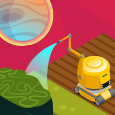

# Space Vegetables

Space Vegetables is a Raspberry PI driven project for the [Element14\'s](https://www.element14.com/community/welcome) [1 Meter of Pi](https://www.element14.com/community/community/design-challenges/1-meter-of-pi?ICID=DCHmain-featured-top3challenges) design challenge. 

## 1 Meter of Pi

_The Challenge goes_

As your rocket ship blasts into space, speeding to Mars, you have 1m3 of space to grow your food and nutrients for the journey. Resources are limited, and you need to make it work!

 

 Luckily, your friends at the element14 Community have provided 20 successful applicants with a Raspberry Pi 4 2GB, a Pimoroni PIM487 Automation HAT, PIM486 Enviro HAT, and a PICO HAT Hacker PCB to help them prepare their 1m3 builds. You have 10 weeks to save your crew.

 This could be the 1m3 of space on your rocket, or it could be used to feed the masses or in an urban setting to help feed the needy during a global disaster.
